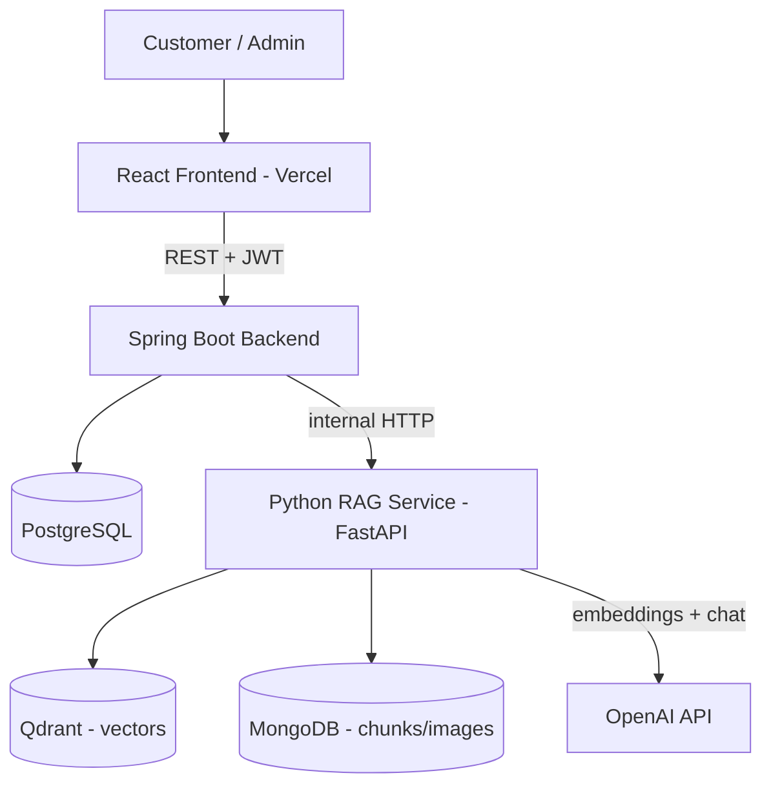
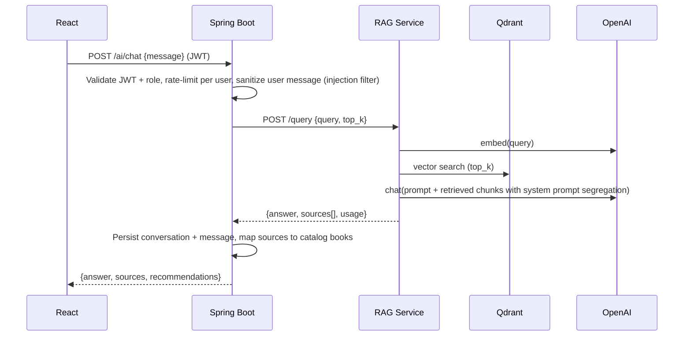
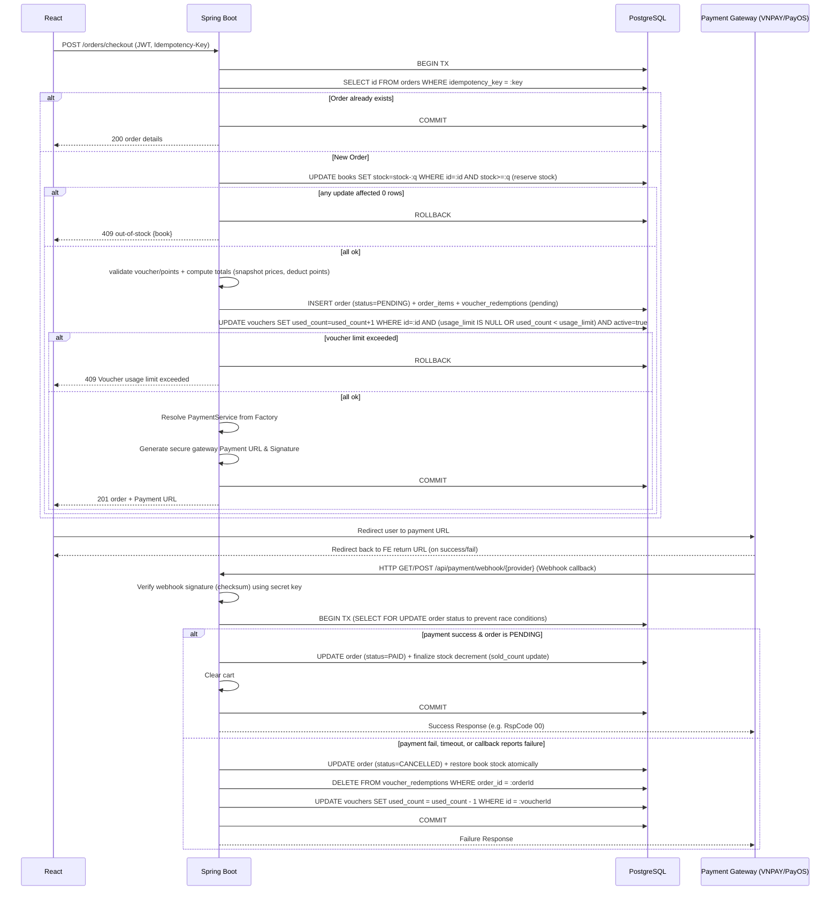

# Design Document

## Overview

The Bookstore RAG Platform is an online bookstore with a Retrieval-Augmented Generation (RAG) AI assistant. This design realizes the requirements in `requirements.md` using a **three-service architecture**:

1. **React frontend** — single-page app (separate repository, deployed on Vercel). Shown here only for system context; it is out of scope for this backend repository.
2. **Spring Boot backend** (`/bookstore` in this repository) — the main REST API. Owns all relational business data in PostgreSQL: authentication/JWT, catalog, reviews, cart, orders, admin, vouchers, and loyalty points. Exposes Swagger/OpenAPI. Deployed on Railway/Render.
3. **Python RAG microservice** (FastAPI, in `/rag`, owned by team member P5) — ingests book files (PDF/EPUB), creates embeddings, performs retrieval, and generates grounded answers. Uses **Qdrant** (vector store) + **MongoDB** (chunk/image/document store, internal to this service only) + **OpenAI**.

The React frontend communicates **only** with the Spring Boot backend. The Spring Boot backend calls the RAG microservice over internal HTTP. This keeps a single security and authorization boundary (the frontend never holds RAG credentials and never reaches Qdrant/Mongo directly).

### Design Goals

- **Correctness under concurrency** — no overselling stock, no double-charging, consistent money math (money stored as integer VND, never floating point).
- **Clear service boundaries** — business logic in Spring Boot, AI logic in the RAG service; each can fail independently.
- **Generic Payment Integration** — abstraction layer (`PaymentService` interface and factory) to support multiple payment gateways (VNPAY, PayOS, etc.) swapping seamlessly via configuration.
- **Security by default** — JWT auth, refresh token rotation with family revocation, role-based access control, ownership checks (no IDOR), secrets via environment variables.
- **Reproducibility** — Flyway migrations, seed data, and `docker-compose` so every member runs an identical environment.
- **Parallel teamwork** — components map cleanly to the six workstreams (WS1–WS6) so six developers work with minimal collisions.

## Architecture

### System Context



### Request Flow — Chatbot (RAG)



### Request Flow — Checkout (atomic, idempotent, generic payment)



### Technology Stack

| Concern | Choice |
|--------|--------|
| Backend | Spring Boot 3 (Java 21), Spring Web, Spring Security, Spring Data JPA, Bean Validation |
| Auth | JWT (access 15m, refresh 7d with rotation), BCrypt |
| API docs | springdoc-openapi (Swagger UI) |
| Relational DB | PostgreSQL, schema via Flyway migrations |
| AI service | Python 3.13, FastAPI, Uvicorn |
| Vector store | Qdrant |
| RAG document store | MongoDB |
| LLM / Embeddings | OpenAI (gpt-4o-mini, text-embedding-3-small, dim 1536) |
| Local dev | docker-compose (postgres + qdrant + mongo) |
| CI/CD | GitHub Actions; deploy FE→Vercel, BE→Railway/Render |

## Components and Interfaces

Components are grouped by workstream. Each lists the requirements it satisfies.

### WS1 — Auth & Accounts (Req 1–4)
- **AuthController / AuthService**: register (creates CUSTOMER, BCrypt hash), login (issues access + refresh tokens), refresh (rotation), profile read/update, password change.
- **JwtTokenProvider**: signs/validates JWT; claims = userId, role. Access 15m, refresh 7d.
- **JwtAuthenticationFilter**: extracts bearer token on protected routes, sets security context; rejects missing/expired/malformed with 401.
- **SecurityConfig**: catalog browse/search public; admin routes require ADMIN; everything else authenticated. Method-level `@PreAuthorize` for fine-grained checks. Webhook endpoint `/api/payment/webhook/**` is whitelisted (permitAll), exempt from CSRF protection, and configured for CORS to accept external POST callbacks. Registers custom `AuthenticationEntryPoint` and `AccessDeniedHandler` to write the standard JSON error schema directly to the response output stream for all 401 and 403 errors, ensuring no default Spring Boot raw/empty responses bypass the global error formatter.
- **RefreshTokenCleanupScheduler**: A scheduled task running daily that deletes expired refresh tokens from the database to prevent infinite table growth.

### WS2 — Catalog & Reviews (Req 5–8)
- **CatalogController / CatalogService**: paginated listing (default 10, max 50/page), search by title/author (case-insensitive), filters (category, author, price range), sort; book detail; 404 with empty body for missing book.
- **ReviewController / ReviewService**: create review (rating 1–5, one per user per book → 409 on duplicate), list reviews paginated, delete own review (403 otherwise), recompute book `rating_avg` on create/update/delete.

### WS3 — Cart & Orders (Req 9–11)
- **CartController / CartService**: add/update/remove line items, reject quantity > stock (400), compute subtotal dynamically with real-time prices. Merges guest session cart with database-backed cart on login, resolving item unit prices to current real-time catalog prices, discarding stale guest prices, and immediately recomputing the cart subtotal.
- **OrderController / OrderService**: checkout (atomic stock reservation, price snapshot, voucher + points validation, idempotency), order history (paginated desc), order detail with ownership check (403 on others'), cancel (PENDING/PAID only → restore stock + reverse points; 409 if SHIPPED/DELIVERED/CANCELLED). Employs pessimistic write locking (`SELECT FOR UPDATE` or `@Lock(LockModeType.PESSIMISTIC_WRITE)`) on the order entity to serialize status changes from payment webhooks, cancellation requests, and stock hold expirations.
- **PaymentService (Interface)**:
  ```java
  public interface PaymentService {
      PaymentResponse createPaymentUrl(Order order, String returnUrl);
      WebhookResult verifyWebhook(Map<String, String> requestParams);
      RefundResponse processRefund(Order order, long amount);
      String getProviderName();
  }
  ```
- **PaymentServiceFactory**: Resolves active `PaymentService` bean at runtime based on `app.payment.provider` config property.
- **PaymentWebhookController**: Exposes generic endpoint `/api/payment/webhook/{provider}` which maps incoming webhook calls to the correct `PaymentService` implementation via factory. Validates cryptographic signatures to protect against fake IPN requests.
- **VnPayPaymentService / PayOsPaymentService**: Implement `PaymentService` interface specifically for VNPAY and PayOS. `VnPayPaymentService` explicitly appends the `vnp_ExpireDate` parameter matching the 15-minute stock hold duration to the generated gateway payment URL.
- **OrderTimeoutScheduler**: Runs as a background task. Periodically queries `PENDING` orders. If an order exceeds the 15-minute stock hold duration without receiving a successful payment webhook, it cancels the order, restores inventory, and releases the voucher. If a successful webhook arrives after cancellation, it compares timestamps and flags for manual resolution.

### WS4 — Admin (Req 12–16)
- **AdminBookController**: CRUD books; reject negative price/stock (400); block delete if referenced by orders (409); emit BookChangedEvent to trigger RAG reindex.
- **AdminCategoryController**: CRUD; unique name (409 on dup); block delete if in use (409).
- **AdminOrderController**: list/filter, status transitions (PAID→SHIPPED→DELIVERED) with invalid transition → 409.
- **AdminUserController**: list, change role, disable account (login then 403); block self role-change/disable (409).
- **AdminVoucherController**: CRUD vouchers and constraints.
- **StatsService**: totals (orders, revenue excluding CANCELLED, users, books), top-5 selling.

### WS5 — AI Integration (Req 17–21)
- **AiController (Spring Boot)**: `POST /ai/chat` and conversation history. Validates JWT/role, enforces per-user rate limit (429), persists conversations/messages, proxies to RAG `/query`, maps returned sources to catalog books, ensures recommendations reference only existing catalog books.
- **RagClient**: HTTP client to the RAG service with configured timeout → 504 on timeout.
- **Python RAG microservice** (P5): see next section.

### WS6 — Platform & DevOps (Req 24–27 + platform reqs)
- **OpenApiConfig**: Swagger with bearer security scheme, per-endpoint role annotations.
- **GlobalExceptionHandler**: consistent JSON error schema.
- **HealthController**: `GET /api/health` app + DB health (200 / 503).
- **RequestLoggingFilter**: logs method, path, status, duration; excludes secrets/tokens.
- **CI/CD**: GitHub Actions builds/tests `/bookstore` (Maven) and `/rag` (pytest), gates merges, deploys on main.

### Python RAG Microservice (P5)

Existing FastAPI service with endpoints:
- `GET /health` → status of Qdrant + MongoDB.
- `POST /ingest {documents?}` → reads PDF/EPUB from `assets/books` using standard pre-built libraries (`pypdf`/`pymupdf` for PDF, `ebooklib` for EPUB) with a text-only fallback to ignore complex formatting/equations (avoiding parsing time traps), splits into chunks (target ~300 tokens, overlap ~100), embeds each chunk, upserts to Qdrant with payload (document_name, file_name, file_type, chunk_index, page, content, book_id), stores full chunk text in MongoDB; replaces prior entries for a re-ingested source (no duplicates); reports indexed + errors + total_chunks.
- `POST /query {query, document_name?, top_k?}` → embeds query, searches Qdrant (top_k ≤ max 20, default 5), maps hits to MongoDB chunks to build sources, generates answer; returns `{answer, sources[], usage}`. When no chunk meets the similarity threshold, instructs the model to answer that the knowledge base lacks the info.

**Required work**: replace `FakeOpenAIService` (embedding + chat adapters) with real OpenAI calls (text-embedding-3-small, gpt-4o-mini), keeping the same interface so the rest of the pipeline is unchanged.

**Asynchronous Reindexing Flow**: When an Admin creates/updates/deletes a book, or deactivates it in Spring Boot, Spring Boot publishes a transactional `BookChangedEvent`. An asynchronous listener intercepts this event and calls the RAG service `/ingest` (or targeted deletion) in a non-blocking background thread. In case of network errors or timeouts, the listener retries with exponential backoff. To ensure eventual consistency, a scheduled reconciliation cron job runs nightly in Spring Boot, scanning PostgreSQL books against Qdrant vector metadata, purging orphans and queueing missing active books.
- **RAG recommendations filter**: When recommendations are retrieved, the AI service filters out any recommended books that have `active == false` or `stock == 0` from the final recommendation array before mapping them to Frontend.

## Data Models

### PostgreSQL Schema (Spring Boot, via Flyway). Money stored as `BIGINT` VND.

```
users(
  id BIGSERIAL PK,
  email VARCHAR UNIQUE NOT NULL,
  password_hash VARCHAR NOT NULL,
  full_name VARCHAR NOT NULL,
  role VARCHAR NOT NULL CHECK (role IN ('ADMIN','CUSTOMER')),
  enabled BOOLEAN NOT NULL DEFAULT true,
  points BIGINT NOT NULL DEFAULT 0,
  lifetime_points BIGINT NOT NULL DEFAULT 0,
  tier VARCHAR NOT NULL DEFAULT 'SILVER',
  created_at TIMESTAMPTZ NOT NULL DEFAULT now()
)

refresh_tokens(
  id BIGSERIAL PK,
  user_id BIGINT REFERENCES users(id) ON DELETE CASCADE,
  token_hash VARCHAR UNIQUE NOT NULL,
  family_id VARCHAR NOT NULL,
  used BOOLEAN NOT NULL DEFAULT false,
  expires_at TIMESTAMPTZ NOT NULL,
  created_at TIMESTAMPTZ NOT NULL DEFAULT now()
)

addresses(id PK, user_id FK->users, recipient, phone, line, city, is_default BOOLEAN)

categories(id PK, name VARCHAR UNIQUE NOT NULL, slug VARCHAR UNIQUE NOT NULL)

books(
  id PK, title, author, category_id FK->categories,
  price BIGINT NOT NULL CHECK (price >= 0),
  original_price BIGINT,
  stock INT NOT NULL CHECK (stock >= 0),
  description TEXT, cover_url VARCHAR,
  rating_avg NUMERIC(2,1) NOT NULL DEFAULT 0,
  sold_count INT NOT NULL DEFAULT 0,
  active BOOLEAN NOT NULL DEFAULT true,
  created_at TIMESTAMPTZ, updated_at TIMESTAMPTZ
)
  INDEX(category_id), INDEX(price), INDEX(lower(title)), INDEX(lower(author))

reviews(
  id PK, book_id FK->books, user_id FK->users,
  rating INT NOT NULL CHECK (rating BETWEEN 1 AND 5),
  comment TEXT, created_at TIMESTAMPTZ,
  UNIQUE(book_id, user_id)
)

carts(id PK, user_id FK->users UNIQUE)
cart_items(id PK, cart_id FK->carts, book_id FK->books, quantity INT CHECK (quantity > 0),
           UNIQUE(cart_id, book_id))

orders(
  id PK, user_id FK->users,
  status VARCHAR CHECK (status IN ('PENDING','PAID','SHIPPED','DELIVERED','CANCELLED')),
  subtotal BIGINT, discount BIGINT, shipping_fee BIGINT, total BIGINT,
  address_snapshot TEXT, payment_method VARCHAR, payment_transaction_id VARCHAR,
  voucher_code VARCHAR, points_used BIGINT DEFAULT 0, points_earned BIGINT DEFAULT 0,
  idempotency_key VARCHAR UNIQUE,
  expires_at TIMESTAMPTZ, created_at TIMESTAMPTZ, updated_at TIMESTAMPTZ
)
  INDEX(user_id, created_at)

order_items(id PK, order_id FK->orders, book_id FK->books,
            title_snapshot VARCHAR, unit_price BIGINT, quantity INT)

vouchers(
  id PK, code VARCHAR UNIQUE NOT NULL,
  type VARCHAR CHECK (type IN ('FIXED','PERCENT','SHIP')),
  value BIGINT, min_order BIGINT DEFAULT 0, max_discount BIGINT,
  usage_limit INT, used_count INT NOT NULL DEFAULT 0, per_user_limit INT DEFAULT 1,
  starts_at TIMESTAMPTZ, ends_at TIMESTAMPTZ, active BOOLEAN DEFAULT true
)

voucher_redemptions(id PK, voucher_id FK->vouchers, user_id FK->users, order_id FK->orders,
                    status VARCHAR, created_at TIMESTAMPTZ, UNIQUE(voucher_id, order_id), UNIQUE(voucher_id, user_id))

point_transactions(id PK, user_id FK->users, order_id FK->orders,
                   delta BIGINT, reason VARCHAR, created_at TIMESTAMPTZ)

conversations(id PK, user_id FK->users, title VARCHAR, created_at TIMESTAMPTZ)
messages(id PK, conversation_id FK->conversations,
         role VARCHAR CHECK (role IN ('user','assistant')),
         content TEXT, sources_json JSONB, created_at TIMESTAMPTZ)
```

### Qdrant (RAG, owned by P5)
- Collection `books`, vector dim 1536 (cosine). Point payload: `{document_name, file_name, file_type, chunk_index, page, content, book_id}`. Point id maps to a MongoDB chunk id. A payload index must be created on `book_id` in Qdrant to optimize vector deletion.

### MongoDB (RAG internal)
- `books_rag.books` — document records (status, file info, page/chunk/image counts, full text, updated_at).
- `books_rag.chunks` — chunk text + preview + page + book metadata, keyed by chunk id.
- `books_rag.images` — extracted images + metadata (not used in querying yet).

## API Design

All error responses use a consistent JSON schema: `{ timestamp, status, error, message, path }`.

| Group | Method & Path | Auth / Role | Purpose |
|------|---------------|-------------|---------|
| Auth | POST /auth/register | public | create CUSTOMER |
| Auth | POST /auth/login | public | issue tokens |
| Auth | POST /auth/refresh | public (refresh token) | rotate access token |
| Auth | GET /auth/me · PUT /me | authenticated | profile |
| Catalog | GET /books?page&size&q&category&minPrice&maxPrice&sort | public | list/search/filter (10-50/page) |
| Catalog | GET /books/{id} | public | detail (404 empty body) |
| Catalog | GET /categories | public | categories |
| Reviews | GET /books/{id}/reviews | public | list |
| Reviews | POST /books/{id}/reviews | CUSTOMER | create (409 dup) |
| Reviews | DELETE /reviews/{id} | owner OR ADMIN | delete (403 otherwise) |
| Cart | GET /cart · POST /cart/items · PUT /cart/items/{id} · DELETE /cart/items/{id} | CUSTOMER | cart ops |
| Order | POST /orders/checkout (Idempotency-Key) | CUSTOMER | place order (PENDING) |
| Order | GET /orders · GET /orders/{id} | owner | history/detail (403 others) |
| Order | POST /orders/{id}/cancel | owner | cancel |
| Voucher | POST /vouchers/apply · GET /me/vouchers | CUSTOMER | voucher |
| Account | GET /me/points | CUSTOMER | loyalty |
| AI | POST /ai/chat · GET /ai/conversations | authenticated, rate-limited | chatbot |
| AI | DELETE /ai/conversations/{id} | owner OR ADMIN | delete conversation |
| Admin | /admin/books, /admin/categories, /admin/orders, /admin/users, /admin/vouchers | ADMIN | management |
| Admin | POST /admin/ai/reindex · GET /admin/stats | ADMIN | async reindex + dashboard |
| Admin | GET /admin/ai/reindex/status | ADMIN | check status of background reindexing |
| RAG (internal) | GET /health · POST /ingest · POST /query | service-to-service | RAG |
| Webhook | GET/POST /api/payment/webhook/{provider} | public | receive IPN callbacks |

## Cross-Cutting Concerns

- **Authentication**: stateless JWT; access 15m, refresh 7d with rotation; BCrypt password hashing.
- **Authorization (RBAC + ownership)**: role checks via Spring Security; ownership checks in services for personal resources to prevent IDOR (a user cannot read/modify another user's order, cart, or review). Enabled status checked per request.
- **Validation**: Bean Validation on all request bodies; violations → 400 listing invalid fields.
- **Concurrency / stock**: atomic conditional update `UPDATE books SET stock=stock-:q WHERE id=:id AND stock>=:q`; 0 rows affected → out-of-stock 409. All checkout work in one transaction.
- **Idempotency**: checkout accepts an `Idempotency-Key`; a unique constraint on `orders.idempotency_key` prevents duplicate orders from retries/double clicks.
- **Money**: integer VND (`BIGINT`/`long`) end to end; no float. Total calculated as: `Discounted Subtotal = Max(0, Subtotal - Discount_Amount)` (Discount is voucher OR points). `Shipping Fee` flat 30k VND (0 VND if `Discounted Subtotal >= 300k VND` or `SHIP` voucher applied). `Net Total = Discounted Subtotal + Shipping Fee`.
- **AI cost control**: per-user rate limit on `/ai/chat` (20 req/minute) → 429; bounded `top_k` (default 5, max 20) and context length (last 10 chronological user/assistant messages, excluding the separate prepended system instructions prompt).
- **Config & secrets**: DB creds, JWT secret, OpenAI key, Qdrant/Mongo URLs from environment variables; missing required var → fail startup with a log naming it. CORS allowed origins from `APP_CORS_ALLOWED_ORIGINS`. `.env` git-ignored.
- **CORS**: restricted to origins configured in `APP_CORS_ALLOWED_ORIGINS`.
- **Observability**: request logging (no secrets), `/api/health` (200/503).
- **Local dev**: `docker-compose` runs postgres + qdrant + mongo with one command; same images used in deployment. Includes container healthchecks (e.g. postgres `pg_isready`, qdrant `curl http://localhost:6333/dashboard`) and `depends_on` conditions.
- **Swagger security**: API docs (springdoc-openapi) are disabled on production using `springdoc.api-docs.enabled=false`.

## Correctness Properties

These properties are intended for property-based testing (PBT).

### Property 1: No overselling
For any sequence of concurrent checkouts against a book, the sum of successfully ordered quantities never exceeds the book's initial stock, and `stock` is never negative. Concurrent status updates to an order (webhooks, timeout, manual cancellation) are serialized via pessimistic locking on the order record to prevent duplicate modifications.
**Validates: Requirements 9.2, 10.2, 10.5**

### Property 2: Voucher limits enforced
A voucher is redeemed at most `per_user_limit` times per user and `usage_limit` times overall, never applies when subtotal is below `min_order`, and its discount never exceeds the order subtotal. Voucher per-user limit checking is handled at the application layer to support `per_user_limit > 1` (no database unique constraint on user-voucher mapping).
**Validates: Requirements 10.8**

### Property 3: Loyalty point integrity
Points are credited only when an order reaches DELIVERED, a cancel/return produces an offsetting negative `point_transaction`, and a user's `points` always equals the sum of their `point_transactions`. A database CHECK constraint prevents the user's total points from becoming negative.
**Validates: Requirements 4.5, 10.9, 11.6**

### Property 4: IDOR prevention
For any user A requesting a resource owned by a different user B, the response is 403 or 404 and never exposes B's data.
**Validates: Requirements 3.3, 8.7, 11.3**

### Property 5: Price snapshot integrity
Each `order_items.unit_price` equals the book price captured at checkout time, regardless of later catalog price changes.
**Validates: Requirements 10.1**

### Property 6: Catalog-grounded recommendations
Every book recommended by the AI corresponds to an existing, active catalog book.
**Validates: Requirements 20.3**

### Property 7: Rate limiting
Once a user exceeds the configured chat rate within a window, further chat requests in that window return 429.
**Validates: Requirements 19.6, 21.3**

### Property 8: Money math consistency
For every order, `total == max(0, subtotal - discount) + shipping_fee`, and all monetary amounts are non-negative integers.
**Validates: Requirements 10.8, 10.9**

### Property 9: Voucher atomicity
Vouchers can never be over-redeemed. Under high concurrent checkouts, the voucher's `used_count` never exceeds its `usage_limit`, and users cannot exceed `per_user_limit`.
**Validates: Requirement 10.8**

### Property 10: Refresh token family revocation
If an attacker attempts to replay an already-used refresh token, all active refresh tokens in that family are immediately revoked (the family is marked fully invalidated), force-logging out all devices of the user.
**Validates: Requirement 2.7**

### Property 11: Password change session invalidation
Changing the user password successfully immediately revokes all refresh tokens and invalidates the session on all devices.
**Validates: Requirement 4.3**

## Error Handling

- Centralized `GlobalExceptionHandler` maps exceptions to the JSON error schema with correct HTTP status (400 validation, 401 auth, 403 authorization/ownership, 404 not found, 409 conflict, 402 payment declined, 429 rate limit, 504 AI timeout).
- RAG client failures/timeouts surface as 504 from `/ai/chat` with a user-friendly message; the chatbot UI shows a graceful fallback.
- Startup fails fast on missing required environment variables.

## Testing Strategy

- **Unit tests**: services (auth, cart, order, voucher, points, stats) with mocked repositories.
- **Integration tests**: controllers + PostgreSQL (Testcontainers) for auth flow, checkout (including concurrency and idempotency), reviews, admin transitions.
- **Property-based tests**: encode the correctness properties above (stock invariants, voucher limits, points, money math).
- **RAG tests** (pytest, existing): chunker, parsers, ingestion, Qdrant/Mongo stores, query; add tests for the real OpenAI adapter behind a fake/contract.
- **CI gate**: GitHub Actions runs backend (Maven) and RAG (pytest) suites; failures block merge to `main`.
